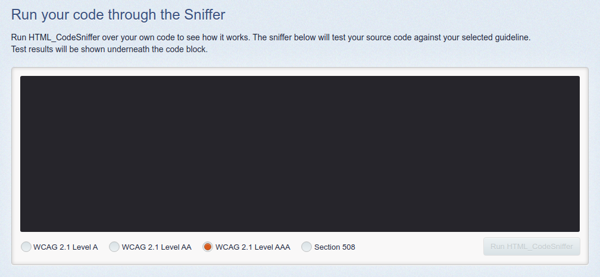

## Agora a prática
Antes de fazer os exercícios, crie um arquivo _HTML_ na pasta `exercises/introducao-a-html-e-css.4` e copie o código abaixo:

```html
<!DOCTYPE html>
<html>
  <head>
    <meta charset="UTF-8" />
    <meta name="viewport" content="width=device-width" />
  </head>
  <body>
    <!--insira os elementos aqui-->
  </body>
</html>
```

O objetivo desses exercícios é colocar em prática o que você acabou de aprender sobre **HTML semântico** .

Para tal, criaremos uma página que apresenta um dos animais mais impressionantes que existem: o [Stomatopoda](https://www.nationalgeographic.com/science/article/natures-most-amazing-eyes-just-got-a-bit-weirder). A estilização da página fica a seu critério. 😉

Para uma melhor organização, faça commits a cada tarefa concluída. Vamos aos exercícios:

1. Adicione um cabeçalho na página contendo o título `Soco a 80km/h: Conheça o Stomatopoda` .

2. Adicione um conjunto de links que representam a área de navegação do site.
    - Crie um link chamado `Página Inicial` .
    - Crie um link chamado `Sobre` .
    - Crie um link chamado `Contato` .

3. Crie um artigo que vai conter os fatos interessantes sobre o `Stomatopoda` . O artigo terá o subtítulo `Fatos sobre o Stomatopoda` . Segue [um site animal](https://theoatmeal.com/comics/mantis_shrimp) de inspiração para pegar fatos.

4. Divida o artigo em seções, organizando-o da seguinte forma:
    - Uma primeira seção contendo informações gerais a respeito do animal. O subtítulo para essa seção fica a seu critério. É necessário que conste nessa seção seu nome científico , que é `Odontodactylus scyllarus` , em itálico. Além disso, é preciso que haja informação tabular a respeito de sua classificação científica, em específico: `Reino` , `Filo` , `Subfilo` , `Classe` , `Subclasse` e `Ordem` . Tais informações você consegue obter na Wikipedia.
    - As outras seções dizem respeito aos fatos interessantes que você escolheu acerca do animal. Para cada fato escolhido você vai criar uma seção.
    - Adicione, para cada seção, um subtítulo referente ao fato escolhido.
    - Adicione, para cada seção, parágrafo(s) descrevendo o fato escolhido. Destaque características impressionantes referentes ao fato que você escolheu, de forma a reforçar a unicidade do `Stomatopoda` . Por exemplo: se você criar uma seção detalhando o soco potente do animal, seria interessante destacar a velocidade desse soco (80km/h) em negrito.
    - Adicione, para cada seção, uma imagem, como forma de ilustrar o fato.
    - Adicione, por fim, uma seção de referências bibliográficas, contendo uma lista de todos os links que foram usados como base para compilar a página em questão.

5. Adicione um conteúdo adjacente ao artigo, disponibilizando um link para este vídeo, que mostra o animal em ação.

6. Adicione um rodapé na página, mostrando algo do gênero:

```html
"Conteúdo compilado por <insere seu nome>, <ano atual>".
```

_Obs_: para esse exercício, é obrigatório fazer uso de, **no mínimo** , 6 elementos com as seguintes tags: `header` , `nav` , `article` , `section` , `h1` , `h2` , `h3`, `aside` , `footer` , `table e img` .

## Validando com CodeSniffer
Agora que você criou a página mostrando fatos interessantes a respeito do Stomatopoda , suponha que uma pessoa com deficiência visual acesse sua página. Será que sua página estará acessível para essa pessoa? 🤔

Vamos averiguar!

Entre [neste site](https://squizlabs.github.io/HTML_CodeSniffer/) , que valida se sua página é acessível ou não. Para isso, você deverá copiar o código HTML e colar na caixa em baixo de "Run your code through the Sniffer".




Ao submeter o código, você vai se deparar com erros de validação presentes em sua página, dando início a seu segundo exercício: **consertar todos os erros apontados** .

Para cada erro de validação mostrado, você tem à disposição um link para a página com sua descrição. **Antes** de voltar para o código e já ir consertando, leia a descrição de cada erro para **entendê-lo** e poder consertá-lo.

_No fim do exercício, além de ter uma página acessível, você vai reforçar a prática de **consertar erros** , seja de validação (para este exercício), seja de lógica, com que você vai se deparar ao longo de sua carreira de desenvolvedor._

## Validando com Lighthouse
Como alternativa, podemos usar o Lighthouse para verificar a acessibilidade e outras coisas. Para isto, abra o site que criou utilizando a extensão `Live Server` do `VSCode` . Iremos utilizar o DevTools do navegador Chrome para analisar a acessibilidade, seguindo os seguintes passos:

1. Abra o DevTools utilizando uma das seguintes formas: ( OBS: Você deverá estar na janela do navegador )
    - Aperte a tecla `F12` ;
    - Utilize o atalho `CTRL + SHIFT + I` ;
    - Através da interface clique nos três pontos na parte superior direita da tela, abrirá um menu, clique em `More tools` e depois em `Developer Tools` .

2. No menu superior haverão várias abas, a que queremos se chama `Lighthouse` . Caso ela esteja escondida, procure por um botão com o ícone similar a `>>` .

3. Ao fazer isso aparecerá um painel onde é possível escolher o que queremos testar e gerar o relatório.

4. Através do relatório podemos corrigir os problemas
