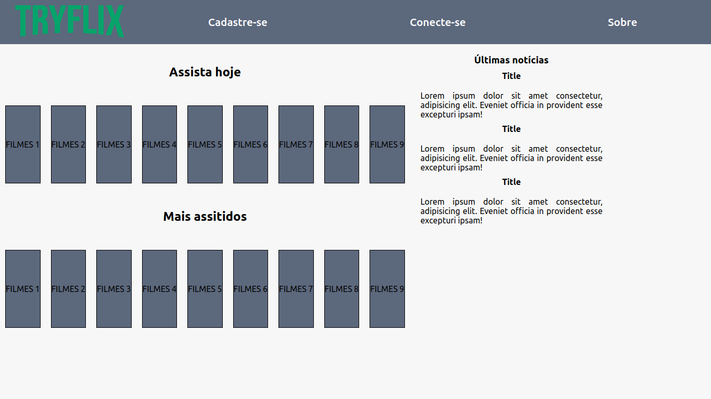

## Agora a prática
Para os exercícios a seguir, crie um arquivo HTML e um arquivo CSS , copie o código abaixo e siga as instruções de cada enunciado.

#### Parte 1
1. Adicione uma propriedade que defina o tamanho `Flexbox` base para o container da imagem 268px e para o container do menu 500px . Após aplicar as propriedades o `header` deverá estar similar a imagem abaixo:

2. Adicione uma propriedade `Flexbox` que modifique a ordem em que a logomarca e os itens do menu aparecem na tela. Após aplicar a propriedade o `header` deverá estar similar a imagem abaixo:

3. Adicione uma propriedade `Flexbox` que faça o container do menu crescer, quando houver espaço disponível. Após aplicar a propriedade o `header` deverá estar similar a imagem abaixo:

4. Utilize a propriedade `align-self` no elemento correto para que o `header` da página tenha o seguinte comportamento:

#### Parte 2
Vamos continuar praticando com a continuação do `header` realizado no exercício acima e construir um `main` com o restante de sua página. Copie o restante dos códigos HTML e CSS e aplique a seus documentos criados anteriormente.

1. Aplique uma base de 350px para seu container aside . Deverá ficar similar a imagem abaixo:

2. Aplique um alinhamento para centralizar e outro para expandir. Seu aside apresentar o seguinte comportamento:

3. Adicione uma propriedade que faça com que seu container de filmes tenha uma base de 700px e outra base de 16% para as div do container de seu card. Deve ficar similar a imagem abaixo:

4. Aplique uma propriedade com o valor 10 que expanda o container de filmes. Deve ficar similar a imagem abaixo:

5. Adicione uma propriedade com o valor 1 que faça com que suas div do container de filmes ocupe todo o espaço em branco. Deve ficar similar a imagem abaixo:
